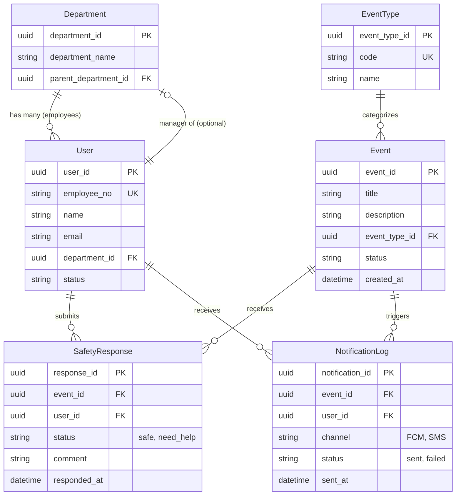
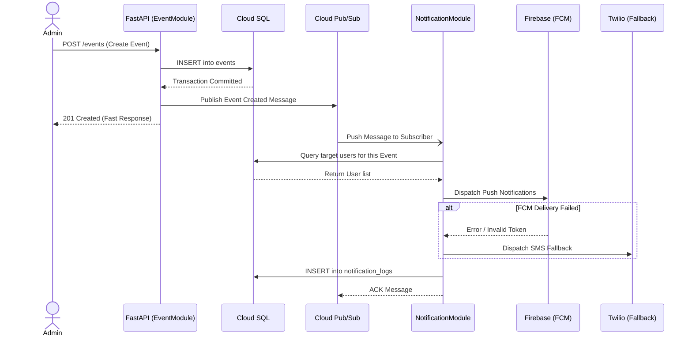
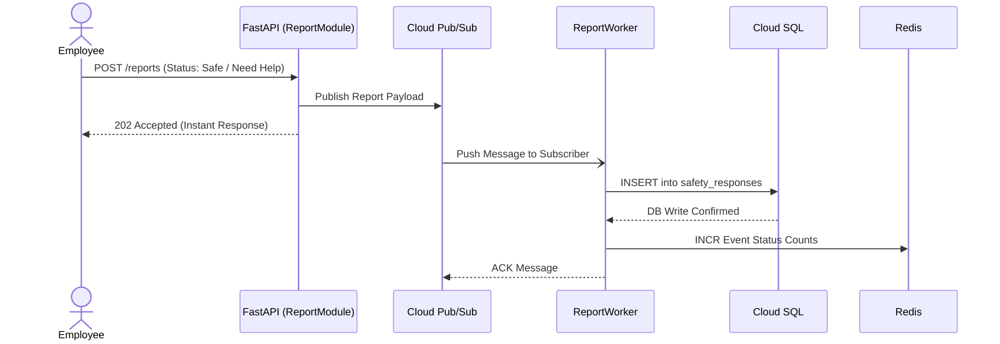

# Employee Safety & Response System - Architecture Documentation

This document explicitly defines the system architecture, sequence flows, and entity-relationship models for the Employee Safety & Response System based on the system proposal.

## 1. Entity-Relationship (ER) Diagram

This diagram aligns with the SQLAlchemy models under `backend/app/models/` (UUID primary keys in the codebase).



The `EventType` SQLAlchemy model maps to the PostgreSQL table **`event_types`**.

## 2. System Architecture Diagram

This component diagram visualizes the GCP-based Serverless Modular Monolith design.

```mermaid
graph TD
    classDef gcp fill:#e3f2fd,stroke:#4285f4,stroke-width:2px;
    classDef ext fill:#fff3e0,stroke:#fbc02d,stroke-width:2px;
    classDef db fill:#e8f5e9,stroke:#ef6c00,stroke-width:2px;

    Client[PWA (Employees / Supervisors / Admins)]

    subgraph GCP [Google Cloud Platform asia-east1]
        CR[Cloud Run Container]:::gcp
        Sched[APScheduler]:::gcp
        
        CR --- Sched

        subgraph Modules [Modular Monolith (FastAPI)]
            Auth[Auth Module]
            EventMod[Event Module]
            ReportMod[Report Module]
            NotifMod[Notification Module]
            UserMod[User Module]
        end
        CR --- Modules

        PubSub{Cloud Pub/Sub}:::gcp
        SQL[(Cloud SQL / PostgreSQL)]:::db
        Redis[(Cloud Memorystore / Redis)]:::db
    end

    Client -- HTTPS --> CR
    Client -- HTTPS --> Firebase[FCM Push]:::ext

    EventMod -- Publish --> PubSub
    ReportMod -- Publish (Buffer) --> PubSub
    Sched -- Publish (Reminder) --> PubSub
    
    PubSub -- Async Trigger --> NotifMod
    PubSub -- Async Buffer Write --> ReportMod

    ReportMod -- Sync Read/Write --> SQL
    NotifMod -- Read Targets --> SQL
    ReportMod -- Update Dash Stats --> Redis

    NotifMod -- Push API --> Firebase
    NotifMod -- Fallback API --> Twilio[Twilio SMS]:::ext
    NotifMod -- On Demand --> SendGrid[SendGrid Email]:::ext
```

## 3. Sequence Diagrams

### Flow A: Event Creation and Notification Dispatch



### Flow B: Employee Safety Reporting



---
